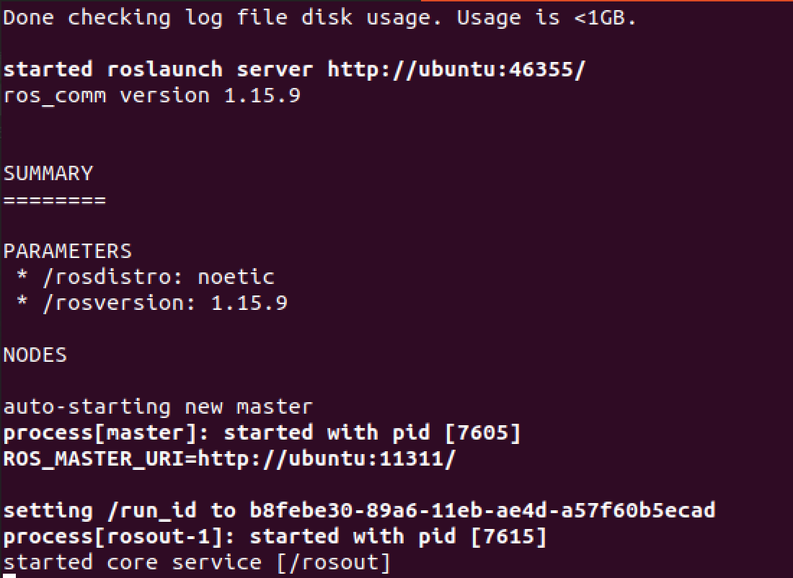

ROS-noetic Installation 
+++++++++++++++++++++++++

If you have gone this far, you should have Ubuntu 20.04.2.0 LTS running. 
If you do not have Ubuntu 20.04 LTS, please go back to the installation :doc:`ubuntuinstall`.

In this section we will be installing and making sure that ROS is running. 
You may visit the official site at `Ubuntu install of ROS Noetic <http://wiki.ros.org/noetic/Installation/Ubuntu>`_

.. caution:: 
   Make sure to choose Noetic for Ubuntu.
 
Set up your source list, to make sure your software accepts ROS packages: 
:: 
   sudo sh -c 'echo "deb http://packages.ros.org/ros/ubuntu $(lsb_release -sc) main" > /etc/apt/sources.list.d/ros-latest.list'  

Set your keys:
::
   sudo apt-key adv --keyserver 'hkp://keyserver.ubuntu.com:80' --recv-key C1CF6E31E6BADE8868B172B4F42ED6FBAB17C654

Make sure your Debian package index is up to date: 
::
   sudo apt update
   
Install ROS-Full-Desktop: 
::
   sudo apt install ros-noetic-desktop-full

Set up your environment (you must source this script in every bash terminal you use ROS in):
::
   source /opt/ros/noetic/setup.bash

Install Tool for building packages: 
:: 
   sudo apt install python3-rosdep python3-rosinstall python3-rosinstall-generator python3-wstool build-essential

Install and initialize rosdep to use many ROS tools: 

Install: 
::
   sudo apt install python3-rosdep

Initialize: 
::
   sudo rosdep init

Now that you have ROS install, you may test it by running: 
::
   roscore

This will run ROS and get something like: 

Installation and Quick Start
------------------------------------

This tutorial video demonstrates how to install :code:`Ros-noetic`.

..  youtube:: ZNqekNFKDuc
    :aspect: 16:9

